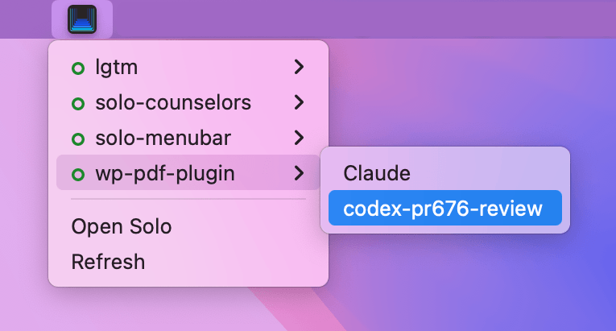

# Solo Menubar

A tiny macOS menu bar widget that shows which of your [Solo](https://soloterm.com) projects have a **running agent or process** — and lets you jump straight into any of them with a single click.

Built as a [SwiftBar](https://github.com/swiftbar/SwiftBar) (or [xbar](https://github.com/matryer/xbar)) plugin. Pure Python, no third‑party dependencies, no remote requests.



## What it does

- Puts the Solo logo in your menu bar.
- Click it to see every project that currently has at least one **running** process (i.e. an "active" project).
- Optional toggles (all off by default) to also list idle projects and show per‑project TODO / scratchpad counts — see [Options](#options) below.
- Each project — and each individual agent, terminal, or command under it — is a clickable **deep link** that opens Solo focused on that exact process.
- Groups each project's processes by kind — **agents first, then terminals, then commands** — with a divider between groups. When an agent spawns subagents, they appear **nested underneath it** as an indented tree, mirroring Solo's own agent hierarchy.
- Hold **⌥ Option** over a running process and the row turns into a **■ Stop** button — click to stop it, and the menu refreshes itself once Solo confirms.
- Refreshes the moment you open the menu — no background polling.
- Shows a friendly error state that tells you whether Solo is closed, its HTTP API is off, or the API just isn't responding.

## Requirements

- macOS
- [SwiftBar](https://github.com/swiftbar/SwiftBar) — `brew install swiftbar` (xbar works too)
- Python 3 (`python3` on your `PATH`; only the standard library is used)
- [Solo](https://soloterm.com) **0.8.2 or newer** running with its **HTTP API enabled**

> [!NOTE]
> Tested against **Solo 0.8.2**. Solo's HTTP API is still evolving and may change in future releases — a Solo update can break the plugin until it's adapted. If the menu suddenly shows *"Solo API changed — update this plugin"* (or an error row that won't go away) right after a Solo update, check here for a newer plugin version. You can Watch for new Releases.

### Enable Solo's HTTP API

The plugin reads Solo's local control plane. Enable the HTTP API in Solo's settings — Solo then writes a discovery file to `~/.config/soloterm/http-api.json`, which the plugin reads to find the API's base URL and its local auth token. No setup beyond the toggle: Solo writes the token itself, and nothing ever leaves your machine.

## Installation

```bash
# 1. Clone
git clone https://github.com/slaFFik/solo-menubar.git ~/Projects/solo-menubar

# 2. Make sure it's executable
chmod +x ~/Projects/solo-menubar/solo-menubar.py

# 3. Symlink it into your SwiftBar plugin folder
ln -s ~/Projects/solo-menubar/solo-menubar.py ~/Documents/SwiftBar/solo-menubar.py
```

Point SwiftBar at your plugin folder (e.g. `~/Documents/SwiftBar`) and the icon appears right away. SwiftBar follows the symlink, so you can keep editing the file in the repo and SwiftBar always runs the latest version.

## How it works

Each time you open the menu (and once on launch), the plugin:

1. Reads the API base URL and bearer token from `~/.config/soloterm/http-api.json`, so it survives Solo restarting on a different port and never needs credentials from you.
2. Calls `GET /api/projects` and `GET /api/processes?status=running` (the unfiltered process list when *Show all projects* is on) and joins them by project. TODO/scratchpad counts, when toggled on, come from each list endpoint's `totalCount` via concurrent `limit=1` probes — one item per request instead of the full list.
3. Keeps any project that has a running process (or all projects, if you toggle that on).
4. Renders a clickable deep link per project/process:
   `solo://proj/{project_id}/process/{slug}--{process_id}`

It refreshes on open via SwiftBar's `refreshOnOpen` flag, so the list is always current the instant you click — without polling Solo in the background.

### Where each feature gets its data

Solo's authenticated **HTTP API** is the primary source. For the two things the API doesn't expose, the plugin takes a read‑only peek at Solo's **SQLite database** (`~/.config/soloterm/solo.db`):

| Feature | HTTP API | SQLite DB |
| --- | :---: | :---: |
| Project & process list, deep links (incl. *Show all projects*) | ✓ | |
| Stop a running process (⌥‑click) | ✓ | |
| TODO counts | ✓ | |
| Scratchpad counts | ✓ | |
| Nesting spawned subagents under their parent | | ✓ |
| Telling "Solo closed" from "HTTP API off" in the error row | | ✓ |

The SQLite reads are opened `mode=ro` and are best‑effort: Solo records subagent lineage in `processes.parent_process_id` and the API toggle in `settings.raycast_api_enabled`, but never serves either over HTTP. If the database is missing, locked, or on an older schema, those features quietly degrade — a flat process list, or the generic error row — rather than break the menu.

## Configuration

**Refresh** — by default the file is named `solo-menubar.py` (no interval), so SwiftBar refreshes it only when you open the menu. The menu bar icon is static, so background polling buys nothing. If you *do* want it to poll as well, encode an interval in the filename:

| Filename | Behavior |
| --- | --- |
| `solo-menubar.py` | Refresh on menu open only *(default)* |
| `solo-menubar.10s.py` | Also poll every 10 seconds |
| `solo-menubar.1m.py` | Also poll every minute |

(Rename the symlink in your SwiftBar plugin folder — SwiftBar reads the interval from the filename it sees there.)

### Options

Toggles at the bottom of the menu. All are **off by default**, and your choices are remembered between launches.

| Option | What it does |
| --- | --- |
| **Show all projects** | List every project, not just those with a running process. Idle projects appear greyed out. The toggle label shows the total project count. |
| **Show TODOs** | Under each project, show its number of open TODOs (only when above zero). |
| **Show Scratchpads** | Under each project, show its number of scratchpads (only when above zero). |

## Troubleshooting

- **"Solo HTTP API not enabled"** — Solo has never written its discovery file; turn the HTTP API on in Solo's settings.
- **"Solo not running"** — open Solo. If it *is* open, re-enable its HTTP API so it rewrites the discovery file.
- **"Solo is running, but its HTTP API isn't responding"** — toggle the HTTP API off and on, or restart Solo.
- **"Solo API changed — update this plugin"** — your Solo speaks a newer API contract than this plugin; grab the [latest plugin release](https://github.com/slaFFik/solo-menubar/releases).
- **Nothing shows in the menu bar** — confirm SwiftBar's plugin folder is set, the file is executable (`chmod +x`), and `python3` is installed (`xcode-select --install`).
- **Menu doesn't update while it's open** — macOS renders a menu at the moment you open it; the plugin re‑reads Solo on each open, so just close and reopen to see fresh data.

## Credits

- [Solo](https://soloterm.com) by Aaron Francis.
- Solo Menubar by [Slava Abakumov](https://ovirium.com).

## License

[MIT](LICENSE)
